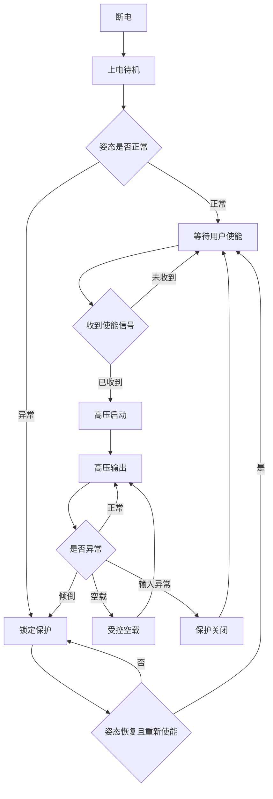
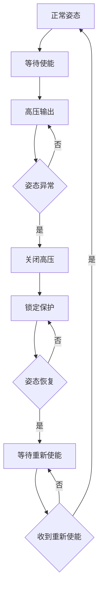

# 24kV高压美容仪全贴片高压电路板 PRD

## 1. 项目背景

### 1.1 需求简介

- 开发一款小尺寸高压直流电路板。
- 输入为 12V 直流。
- 输出为 20kV 至 24kV 直流。
- 输出电流目标为 0.3uA 至 0.8uA。
- 电路板外形尺寸小于 50mm x 30mm。
- 电路板高度不限，但需要满足整机装配。
- 产品需要支持长期空载开路。
- 产品需要支持倾倒保护。
- 产品需要适用于美容仪人体附近使用场景。

### 1.2 业务诉求

- 在小尺寸内实现稳定高压输出。
- 在人体附近使用时控制高压风险。
- 在长期空载开路时避免击穿、爬电、电晕、碳化和器件老化。
- 在设备倾倒、跌落、误放置时关闭高压输出。
- 通过明确规格、测试条件和失效判据，支持研发评审、安规评审、供应链导入和量产验收。

### 1.3 适用范围

- 本 PRD 适用于高压电路板的产品定义。
- 本 PRD 适用于原理验证、工程样机、小批量和量产阶段。
- 本 PRD 适用于研发、测试、结构、采购、生产和质量团队。
- 本 PRD 不提供可直接制造的高压电路原理图。
- 本 PRD 不替代目标市场的安规认证、法规判断和人体安全评估。

### 1.4 前置合规要求

- 项目立项时需要确认目标销售市场。
- 项目立项时需要确认产品是否属于普通美容电器、个人护理电器、医疗器械或其他监管类别。
- 项目立项时需要确认适用安全标准。
- 参考标准范围包括但不限于 IEC 60335-2-23 及目标市场个人护理类电器要求。
- EMC 参考范围包括但不限于 IEC 61000-4-2、IEC 61000-4-4、IEC 61000-4-5、CISPR 14 或目标市场同等要求。
- 环保合规参考范围包括 RoHS、REACH 及目标市场同等要求。
- 若整机使用电池，需要确认电池、充电和运输相关要求。
- 若整机使用外部适配器，需要确认适配器安规、EMC 和认证要求。
- 若产品存在医疗或医美宣传，需要确认 FDA、NMPA、MDR 或目标市场同等监管路径。
- 若产品宣传、结构或使用方式涉及治疗、诊断、疾病改善或医美用途，需要单独确认医疗器械监管路径。
- 未完成法规路径确认前，不得进入量产阶段。

### 1.5 术语说明

| 术语 | 定义 |
|---|---|
| 高压输出 | 20kV 至 24kV 直流输出 |
| 输出电流 | 在定义负载模型、测量仪器和采样时间下测得的高压输出电流 |
| 空载开路 | 高压输出端无外接负载，且高压端处于悬空状态 |
| 标准负载 | 用于常规性能验收的人体等效或电极等效负载 |
| 极限负载 | 用于验证边界稳定性的最大、最小、潮湿、污染或短路类负载 |
| 倾倒保护 | 姿态异常时关闭高压输出并进入锁定保护 |
| 全贴片 | 低压控制、保护和检测器件优先采用贴片封装；高压变压器、高压端子、绝缘结构件允许非贴片，但必须满足尺寸、装配和可靠性约束 |
| 单故障 | 任一关键器件或关键连接出现开路、短路、失效、误动作或卡死 |
| 临时值 | 用于 EVT 前方案估算和摸底验证的暂定值 |
| EVT 验证值 | 原理验证阶段需要实测确认的参数 |
| DVT 冻结值 | 工程验证阶段冻结并进入设计评审的参数 |
| PVT 控制值 | 小批量阶段用于制程能力和质量控制的参数 |
| 量产控制值 | 量产阶段必须执行和追溯的参数 |

## 2. 产品目标

### 2.1 功能目标

- 支持 12V 直流输入。
- 支持 20kV 至 24kV 直流输出。
- 支持 0.3uA 至 0.8uA 输出电流控制。
- 支持长期空载开路运行。
- 支持姿态检测。
- 支持倾倒后关闭高压输出。
- 支持倾倒后锁定保护。
- 支持重新使能后恢复高压启动。

### 2.2 尺寸目标

- 电路板长边小于 50mm。
- 电路板短边小于 30mm。
- 高度由整机结构评审确认。
- 灌封、线束、端子和绝缘结构需要计入装配空间。

### 2.3 安全目标

- 高压不可被用户直接触及。
- 可接触部位需要与高压区域形成可靠隔离。
- 单故障条件下不得出现不可接受的人体触电风险。
- 倾倒、跌落、潮湿、污染、空载和误用条件下不得出现持续拉弧。
- 断电后残余高压需要在规定时间内下降。

### 2.4 可靠性目标

- 长期空载开路后功能不失效。
- 高温、高湿、温循后高压输出仍满足规格。
- 灌封后无气泡、开裂、脱粘和碳化路径。
- 替代料导入后关键参数不低于原设计要求。

## 3. 立项前置条件

### 3.1 必须关闭项

| 编号 | 前置条件 | 关闭要求 | 未关闭影响 |
|---|---|---|---|
| P1 | 输出极性 | 必须确认正高压、负高压或双极性 | 不得冻结高压方案 |
| P2 | 输出定义 | 必须区分开路电压、标定负载电流、人体等效负载电流和放电电流 | 不得冻结输出规格 |
| P3 | 目标负载 | 必须确认标准负载、极限负载、误用负载的 R、C、间隙和介质 | 不得冻结输出规格 |
| P4 | 可接触区域 | 必须确认人体可接触部位和不可接触部位 | 不得进入安规评审 |
| P5 | 倾倒姿态包络 | 必须确认正常使用姿态包络、触发姿态和恢复姿态 | 不得冻结姿态检测方案 |
| P6 | 断电残压 | 必须确认残压、电荷和能量限值 | 不得进入工程样机 |
| P7 | 使用环境 | 必须确认温度、湿度、海拔、清洁液、汗液、化妆品污染 | 不得进入可靠性测试 |
| P8 | 法规路径 | 必须确认目标市场适用标准和监管分类 | 不得进入量产 |

### 3.2 默认工程边界

- 本 PRD 所有数值必须标注状态。
- 临时值只用于 EVT 前方案估算。
- EVT 验证值只用于原理验证和风险收敛。
- DVT 冻结值用于工程样机验收。
- PVT 控制值用于小批量制程能力确认。
- 量产控制值用于出厂检验和质量追溯。
- 临时值不得直接作为量产承诺。
- 任一参数状态升级时，需要同步更新测试计划、物料要求和验收标准。

### 3.3 参数状态表

| 状态 | 使用阶段 | 责任人 | 放行条件 |
|---|---|---|---|
| 临时值 | 概念评审、EVT 前 | 产品、硬件、安规 | 记录来源和假设 |
| EVT 验证值 | 原理验证 | 硬件、测试 | 有实测数据 |
| DVT 冻结值 | 工程样机 | 硬件、结构、安规、测试 | 通过设计评审 |
| PVT 控制值 | 小批量 | 工艺、质量、供应链 | 有制程能力数据 |
| 量产控制值 | 量产 | 质量、生产、供应链 | 有检验规范和追溯规则 |

## 4. 电气规格表

### 4.1 输入规格

| 项目 | 要求 | 参数状态 | 测试条件 | 判定标准 |
|---|---|---|---|---|
| 标称输入电压 | 12V 直流 | 量产控制值 | 常温，标准负载 | 正常启动 |
| 正常输入范围 | 10.8V 至 13.2V | DVT 冻结值 | 常温，标准负载 | 输出满足规格 |
| 启动电压 | 不低于 10.8V | DVT 冻结值 | 缓慢升压，持续 100ms | 达到阈值后进入待机 |
| 欠压关闭 | 低于 10.0V 持续 100ms 关闭 | DVT 冻结值 | 缓慢降压 | 高压关闭，无反复抖动 |
| 欠压恢复 | 高于 10.8V 持续 300ms 恢复待机 | DVT 冻结值 | 缓慢升压 | 不自动输出高压 |
| 过压关闭 | 高于 15.0V 持续 50ms 关闭 | DVT 冻结值 | 缓慢升压 | 高压关闭，不损坏 |
| 过压恢复 | 低于 13.2V 持续 300ms 恢复待机 | DVT 冻结值 | 缓慢降压 | 不自动输出高压 |
| 掉电再上电 | 掉电后重新上电进入待机 | DVT 冻结值 | 断电 1s 后上电 | 不自动输出高压 |
| 反接保护 | 12V 反接 60s | DVT 冻结值 | 常温 | 不起火，不爆裂，关键器件不失效 |
| 最大输入电流 | 平均电流小于 300mA，峰值小于 600mA | 临时值，DVT 冻结 | 额定输出 | 不超过热设计和适配器预算 |
| 待机电流 | 小于 5mA | 临时值，PVT 控制 | 高压关闭 | 不超过电源预算 |
| 输入纹波容忍 | 12V 叠加 200mVpp | DVT 冻结值 | 标准负载 | 不误触发，不异常关断 |
| 输入浪涌 | 预设按 500V 共模摸底，最终按目标标准 | 临时值，法规修订 | 生产前确认 | 不损坏，不误开启高压 |

### 4.2 输出规格

| 项目 | 要求 | 参数状态 | 测试条件 | 判定标准 |
|---|---|---|---|---|
| 开路输出电压 | 20kV 至 24kV 直流 | DVT 冻结值 | 高阻电压测量拓扑 | 全部样机满足 |
| 输出极性 | 立项前确认 | DVT 冻结值 | 高阻电压测量拓扑 | 与定义一致 |
| 标定负载输出电流 | 0.3uA 至 0.8uA | DVT 冻结值 | 25GΩ 至 80GΩ 高阻标定负载，采样 10s | 平均值满足 |
| 人体等效负载电流 | 待安规评估冻结 | DVT 冻结值 | 人体等效 R/C 负载 | 不超过安全评估限值 |
| 短路限流 | 待安规评估冻结 | DVT 冻结值 | 保护工装短接 | 不起火，不爆裂，不持续拉弧 |
| 最大瞬态电流 | 待安全评估冻结 | DVT 冻结值 | 负载突变 | 不超过安全评估限值 |
| 最大输出储能 | 临时目标小于 0.25mJ，最终按安规冻结 | 临时值，DVT 冻结 | 断电和放电测试 | 不超过安全评估限值 |
| 单次放电能量 | 临时目标小于 0.25mJ，最终按安规冻结 | 临时值，DVT 冻结 | 标准放电路径 | 不超过安全评估限值 |
| 稳态纹波 | 临时目标小于 1.0kVpp，带宽 10Hz 至 100kHz | 临时值，DVT 冻结 | 高阻电压测量拓扑 | 无异常放电，无体验异常 |
| 启动时间 | 3s 内达到 90% 目标开路电压 | 临时值，DVT 冻结 | 高阻电压测量拓扑 | 无过冲失控 |
| 最大过冲 | 不超过目标上限 5% 或 1.0kV，取较小值 | 临时值，DVT 冻结 | 启动和负载突变 | 不击穿，不持续放电 |
| 负载突变恢复 | 2s 内恢复稳定或进入保护 | 临时值，DVT 冻结 | 标定负载切换极限负载 | 不锁死，不失控 |
| 检测确认时间 | 倾倒信号持续 50ms 至 150ms 后确认 | 临时值，DVT 冻结 | 姿态夹具 | 不因抖动误动作 |
| 驱动关断时间 | 确认关闭后 100ms 内停止升压 | 临时值，DVT 冻结 | 关闭使能或倾倒触发 | 高压驱动关闭 |
| 输出残压下降 | 正常关机和倾倒后 1s 低于 5kV，5s 低于 1kV，30s 低于 60V 或储能小于 0.25mJ | 临时值，DVT 冻结 | 指定残压测量拓扑 | 满足安规评审结论 |
| 单故障后残压 | 单故障后 30s 低于 60V 或储能小于 0.25mJ | 临时值，DVT 冻结 | 单故障测试后测量 | 满足安规评审结论 |

### 4.3 输出电流定义

- 20kV 至 24kV 指开路或超高阻测量条件下的直流输出电压。
- 0.3uA 至 0.8uA 指 25GΩ 至 80GΩ 高阻标定负载下的稳态平均输出电流。
- 20kV 至 24kV 与 0.3uA 至 0.8uA 不得直接套用到低阻人体等效负载。
- 人体等效负载下需要单独记录输出电压、电流、储能和单次放电能量。
- 采样时间默认 10s。
- 测试仪器内阻、夹具泄漏、探头倍率、采样频率需要写入测试记录。
- 短路限流、瞬态峰值电流、人体等效负载电流需要分别记录。
- 不允许只用空载电压推算输出电流。

### 4.4 高压测量拓扑

| 测量项目 | 推荐拓扑 | 设备门槛 | 扣除方法 | 测量不确定度 |
|---|---|---|---|---|
| 开路输出电压 | 静电电压表或等效超高阻分压器 | 等效输入阻抗不低于 1TΩ，输入电容不高于 5pF | 空夹具读数扣除 | DVT 前给出不确定度报告 |
| 标定负载电流 | 高压端串接 25GΩ、50GΩ、80GΩ 负载组 | 电阻耐压、温漂和漏电满足 24kV | 空夹具泄漏扣除 | 目标不超过读数的 10% |
| 人体等效负载电流 | 人体等效 R/C 网络加隔离测量 | 测量设备不得改变保护动作 | 空夹具泄漏扣除 | 目标不超过读数的 10% |
| 残压释放 | 指定高阻残压探头 | 等效输入阻抗不低于 100GΩ | 断电前后零点扣除 | DVT 前给出不确定度报告 |
| 短路限流 | 保护工装加隔离电流测量 | 工装可承受最大放电能量 | 工装阻抗记录 | 目标不超过读数的 10% |

### 4.5 残压释放场景

| 场景 | 驱动关闭要求 | 输出残压要求 | 备注 |
|---|---|---|---|
| 正常关机 | 100ms 内停止升压 | 1s 低于 5kV，5s 低于 1kV，30s 低于 60V 或储能小于 0.25mJ | 临时值，DVT 冻结 |
| 输入断电 | 立即停止升压 | 1s 低于 5kV，5s 低于 1kV，30s 低于 60V 或储能小于 0.25mJ | 临时值，DVT 冻结 |
| 倾倒触发 | 确认后 100ms 内停止升压 | 1s 低于 5kV，5s 低于 1kV，30s 低于 60V 或储能小于 0.25mJ | 临时值，DVT 冻结 |
| 单故障保护 | 保护链路优先关闭 | 30s 低于 60V 或储能小于 0.25mJ | 临时值，DVT 冻结 |

## 5. 标准负载模型

### 5.1 标准负载冻结表

| 负载名称 | 用途 | 临时参数 | 参数状态 | 必须记录 |
|---|---|---|---|---|
| 高阻标定负载 | 验证 0.3uA 至 0.8uA | 25GΩ、50GΩ、80GΩ，耐压不低于 30kV，寄生电容不高于 10pF | DVT 冻结 | 电阻值、耐压、温漂、泄漏、湿度 |
| 开路电压负载 | 验证 20kV 至 24kV | 等效阻抗不低于 1TΩ，输入电容不高于 5pF | DVT 冻结 | 探头型号、阻抗、电容、校准日期 |
| 人体等效 R/C | 验证人体附近风险 | 临时模型为 100kΩ 并联 100pF，最终按安规确认 | DVT 冻结 | R、C、接线、波形、能量 |
| 电极等效负载 | 验证实际电极工作 | 电极材料、接触面积、间隙由结构冻结 | DVT 冻结 | 材料、面积、间隙、介质 |
| 空气间隙负载 | 验证放电边界 | 1mm、3mm、5mm、10mm 间隙摸底 | EVT 验证 | 间隙、湿度、暗室照片 |
| 污染负载 | 验证潮湿和残留风险 | 汗液、清洁剂、化妆品代表介质 | DVT 冻结 | 介质、覆盖面积、位置 |
| 短路负载 | 验证保护动作 | 保护工装短接 | DVT 冻结 | 工装阻抗、持续时间、放电痕迹 |

### 5.2 物理闭合规则

- 高阻标定负载用于闭合 20kV 至 24kV 与 0.3uA 至 0.8uA 的欧姆关系。
- 25GΩ 对应 20kV 时电流约 0.8uA。
- 80GΩ 对应 24kV 时电流约 0.3uA。
- 人体等效 R/C 负载不要求维持 20kV 至 24kV。
- 人体等效 R/C 负载只用于验证保护、限流、储能和可接触风险。
- 电极等效负载用于验证实际使用效果和放电形态。
- 任一负载模型变更后，需要重新评估输出规格、残压释放、EOL 测试和 Cpk。

### 5.3 电极冻结表

| 项目 | 冻结要求 | 阶段 |
|---|---|---|
| 电极材料 | 需要确认导电材料、镀层和表面处理 | DVT |
| 接触面积 | 需要确认单个电极和总接触面积 | DVT |
| 电极间隙 | 需要确认最小、标称和最大间隙 | DVT |
| 介质条件 | 需要确认干燥、湿润、凝胶、清洁后残留 | DVT |
| 安装状态 | 需要确认装到位、半装到位、脱落状态 | DVT |

### 5.4 极限负载要求

- 极限负载需要覆盖最小阻抗。
- 极限负载需要覆盖最大阻抗。
- 极限负载需要覆盖输出端短路。
- 极限负载需要覆盖输出端半接触。
- 极限负载需要覆盖潮湿污染路径。
- 极限负载需要覆盖电极未装到位。

### 5.5 误用负载要求

- 用户湿手接触外壳。
- 清洁液进入输出端附近。
- 化妆品残留附着输出端附近。
- 电极头未安装到位。
- 高压线束松动。
- 用户拆机后误触高压区域。

## 6. 绝缘与结构约束

### 6.1 高压绝缘设计约束表

| 区域 | 设计约束 | 必交输出物 | 验收方式 | 备注 |
|---|---|---|---|---|
| 裸板高压节点 | 需要按 24kV、污染等级、海拔和材料 CTI 计算 | 《绝缘距离计算书》 | 设计评审和耐压测试 | 小尺寸内不得只按普通低压规则布线 |
| 灌封后高压节点 | 需要验证灌封厚度、气泡和附着力 | 《灌封厚度图》 | 切片、X 光或等效检查 | 不得有贯通气泡 |
| 高压风险点 | 需要标注尖端、窄缝、跨层、端部、线束出口 | 《高压风险点标注图》 | 暗室观察和空载老化 | 每个风险点需要处理结论 |
| 高压线束端 | 需要防止端部电晕和尖端放电 | 《线束固定和端部处理图》 | 暗室观察和拉力检查 | 端部需要固定 |
| 外壳端 | 可接触部位需要满足隔离要求 | 《可接触区域隔离图》 | 安规评审和结构检查 | 外壳材料需要确认 |
| 低压控制区 | 与高压区保持明确隔离 | PCB 高低压分区图 | PCB 评审 | 必要时开槽或隔离墙 |
| 姿态检测区 | 不得被高压干扰误触发 | 姿态信号抗扰评审记录 | EMC 和高压运行测试 | 走线需要隔离 |

### 6.2 灌封与绝缘材料要求

| 项目 | 候选门槛 | 参数状态 |
|---|---|---|
| 介电强度 | 不低于 20kV/mm，最终按厚度和降额计算 | DVT 冻结 |
| 体积电阻率 | 不低于 1e14Ω·cm | DVT 冻结 |
| 吸水率 | 不高于 0.5% | DVT 冻结 |
| CTI | PCB 和暴露绝缘材料目标不低于 600 | DVT 冻结 |
| 阻燃等级 | 目标 UL94 V-0 或目标市场等效要求 | DVT 冻结 |
| 工作温度 | 覆盖 -20℃ 至 60℃ 存储和 0℃ 至 40℃ 工作 | DVT 冻结 |
| 固化收缩率 | 目标不高于 1% | DVT 冻结 |
| 硬度 | 需要兼顾固定和应力释放 | DVT 冻结 |
| 热膨胀系数 | 需要避免温循后开裂 | DVT 冻结 |
| 附着力 | 需要覆盖 PCB、线束、端子和元件表面 | DVT 冻结 |
| 固化放热 | 不得损坏元件和绝缘层 | DVT 冻结 |
| 气泡要求 | 不允许贯通气泡；非贯通气泡最大尺寸由 DVT 冻结 | DVT 冻结 |
| 返修策略 | 高压灌封区量产默认不可返修；返修必须重新耐压和空载验证 | PVT 控制 |

### 6.3 全贴片定义

- 低压控制器件优先采用贴片器件。
- 输入保护器件优先采用贴片器件。
- 姿态检测器件优先采用贴片器件。
- 高压变压器允许采用非贴片结构。
- 高压端子允许采用非贴片结构。
- 高压绝缘结构件允许采用非贴片结构。
- 放电、限流和倍压相关器件是否贴片由耐压、爬电、温升和供应链共同评审。
- 所有非贴片器件必须满足 50mm x 30mm 外形约束和整机装配约束。

## 7. 详细功能说明

### 7.1 功能一：直流输入

#### 7.1.1 位置

- 电路板 - 输入端 - 12V 直流接口。

#### 7.1.2 目标

- 为高压升压模块提供稳定输入。

#### 7.1.3 功能描述

- 输入接口需要明确正负极。
- 输入接口需要具备防反接能力。
- 输入接口需要具备过压关闭能力。
- 输入接口需要具备欠压关闭能力。
- 输入接口需要具备输入纹波容忍能力。
- 输入接口需要具备生产测试接入能力。

#### 7.1.4 验收标准

- 10.8V 至 13.2V 输入时，输出满足规格。
- 低于欠压关闭阈值时，高压关闭。
- 高于过压关闭阈值时，高压关闭。
- 12V 反接 60s 后，不起火、不爆裂、不产生不可恢复危险。

### 7.2 功能二：高压直流输出

#### 7.2.1 位置

- 电路板 - 输出端 - 高压直流接口。

#### 7.2.2 目标

- 输出可控的 20kV 至 24kV 直流高压。

#### 7.2.3 功能描述

- 输出极性必须在立项阶段确认。
- 开路输出电压必须按高阻电压测量拓扑验收。
- 标定负载输出电流必须按 25GΩ 至 80GΩ 高阻负载验收。
- 人体等效负载电流必须按人体等效 R/C 网络单独验收。
- 输出端需要具备限流能力。
- 输出端需要具备残压释放方案。
- 输出端需要避免用户直接触及。
- 输出端需要避免端部尖端放电。

#### 7.2.4 验收标准

- 高阻测量条件下开路输出电压为 20kV 至 24kV。
- 高阻标定负载下输出电流为 0.3uA 至 0.8uA。
- 人体等效负载下电流、储能和单次放电能量不超过安全评估限值。
- 负载突变时不出现持续过冲。
- 关断后残压释放满足 4.5 残压释放场景。

### 7.3 功能三：长期空载开路

#### 7.3.1 位置

- 电路板 - 高压输出端 - 空载工作状态。

#### 7.3.2 目标

- 保证高压输出端长期未接负载时不失效。

#### 7.3.3 功能描述

- 空载开路时高压输出不得超过设计上限。
- 空载开路时不得出现持续拉弧。
- 空载开路时不得出现可见电晕失控。
- 空载开路时不得出现碳化、开裂、鼓包、灌封脱粘。
- 空载开路后接入标准负载，输出应恢复正常。

#### 7.3.4 验收条件

| 测试项目 | 条件 | 时长 | 判定标准 |
|---|---|---|---|
| 常温空载 | 25℃，45%RH 至 65%RH | 72h | 无击穿、无碳化、无持续拉弧 |
| 高温空载 | 60℃ | 72h | 无击穿、无碳化、输出恢复正常 |
| 高湿空载 | 40℃，90%RH | 72h | 无击穿、无碳化、无明显绝缘退化 |
| 温循后空载 | 按可靠性计划 | 临时 24h，DVT 冻结 | 无开裂、无脱粘、无异常放电 |
| 灌封后空载 | 完全固化后 | 72h | 无气泡扩展、无局部击穿 |

### 7.4 功能四：倾倒保护

#### 7.4.1 位置

- 电路板 - 姿态检测端 - 姿态检测器件。

#### 7.4.2 目标

- 设备倾倒时关闭高压输出并进入锁定保护。

#### 7.4.3 功能描述

- 姿态检测器件可采用滚珠开关、机械倾斜开关、霍尔方案、MEMS 方案或其他可靠方案。
- 具体器件由触发角度、寿命、抗冲击、失效模式和供应链评审决定。
- 不使用单一角度定义正常使用状态。
- 需要先定义正常使用姿态包络。
- 正常使用姿态包络需要覆盖握持、移动、贴近皮肤、离开皮肤、短暂停顿。
- 临时倾倒触发条件为连续 100ms 超出正常使用姿态包络。
- 临时恢复条件为连续 300ms 回到正常使用姿态包络。
- 姿态包络、触发条件和恢复条件需要在整机结构确认后冻结。
- 姿态检测信号需要具备抖动处理。
- 姿态检测失效时，默认进入高压关闭状态。

#### 7.4.4 交互规则

- 【设备正常姿态】->【允许等待使能】。
- 【用户使能高压】->【启动前检查姿态】。
- 【姿态正常】->【允许高压输出】。
- 【设备倾倒】->【关闭高压输出并进入锁定保护】。
- 【设备持续倾倒】->【保持锁定保护】。
- 【设备恢复正常姿态】->【继续保持锁定保护】。
- 【用户重新使能】->【重新检查姿态，通过后启动高压】。

#### 7.4.5 验收标准

- 姿态异常持续达到检测确认时间后，系统进入倾倒触发。
- 检测确认时间默认 50ms 至 150ms，由 DVT 冻结。
- 倾倒确认后 100ms 内关闭高压驱动。
- 输出残压下降按 4.5 残压释放场景执行。
- 倾倒保持期间，高压不得自动启动。
- 恢复正常姿态后，高压不得自动恢复。
- 连续晃动时，不得出现高压快速反复开关。
- 姿态检测器件接点抖动时，不得误启动高压。
- 姿态检测器件开路、短路或卡死时，系统不得进入危险高压输出状态。

### 7.5 功能五：人体附近使用安全

#### 7.5.1 位置

- 整机 - 用户可接触区域 - 高压输出相关区域。

#### 7.5.2 目标

- 降低人体附近使用的触电、灼伤、惊吓、臭氧和误用风险。

#### 7.5.3 功能描述

- 需要定义用户可接触部位。
- 需要定义用户不可接触高压部位。
- 需要定义清洁液、汗液、凝胶、化妆品污染场景。
- 需要定义湿手误用场景。
- 需要定义拆机误触场景。
- 需要定义单故障条件下的人体风险。

#### 7.5.4 验收标准

- 可接触部位不得出现超过安全评估限值的残余电压。
- 清洁液或汗液污染后，不得形成持续放电路径。
- 单故障条件下，不得出现不可接受的人体触电风险。
- 误用测试后，外壳不得碳化、开裂、熔融或带电可触及。

## 8. 单故障安全表

| 单故障项目 | 失效模式 | 测试方法 | 验证层级 | 预期保护结果 | 验收判据 |
|---|---|---|---|---|---|
| 限流电阻 | 开路 | 样机断开等效节点 | DVT 实测 | 高压无输出或输出降低 | 不产生危险高压路径 |
| 限流电阻 | 短路 | 样机短接等效节点 | DVT 实测 | 保护关闭或能量受限 | 输出电流不超过安全评估限值 |
| 高压电容 | 击穿 | 等效短路或失效件替换 | DVT 实测 | 保护关闭或无危险失效 | 不起火、不爆裂 |
| 高压二极管 | 短路 | 等效短路 | DVT 实测 | 输出异常受控 | 不持续拉弧 |
| 高压二极管 | 开路 | 等效开路 | DVT 实测 | 输出降低或无输出 | 不损坏其他关键器件 |
| 反馈回路 | 开路 | 断开反馈路径 | DVT 实测 | 高压关闭或受限 | 不失控升压 |
| 反馈回路 | 短路 | 短接反馈路径 | DVT 实测 | 高压关闭或受限 | 不超过输出上限 |
| 姿态检测器件 | 开路 | 断开姿态信号 | EOL 抽检，DVT 实测 | 高压关闭 | 不允许启动 |
| 姿态检测器件 | 短路 | 短接姿态信号 | EOL 抽检，DVT 实测 | 高压关闭或锁定 | 不允许危险输出 |
| 主控使能 | 卡死高电平 | 强制使能信号 | DVT 实测 | 保护链路关闭高压 | 倾倒仍可关闭 |
| 输入保护 | 失效 | 输入异常注入 | DVT 实测 | 不造成起火爆裂 | 输入异常可控 |
| 灌封材料 | 气泡或脱粘 | 人工缺陷样品或切片分析 | PVT 抽检 | 测试中剔除 | 不进入量产 |
| 高压线束 | 松脱 | 连接器半插和脱落模拟 | DVT 实测 | 高压关闭或无危险放电 | 不持续拉弧 |
| 外壳污染 | 潮湿导电 | 污染介质涂覆 | DVT 实测 | 保护或绝缘仍有效 | 可接触部位安全 |
| PCB 污染 | 助焊剂残留 | 污染残留样品测试 | DVT 实测，PVT 抽检 | 无持续放电 | 无碳化、无电晕 |
| 连接器污染 | 潮湿污染 | 污染和潮湿组合 | DVT 实测，PVT 抽检 | 不形成危险路径 | 无持续放电 |

## 9. 局部放电、电晕与失效分级

### 9.1 检查项目

- 暗室观察高压端是否有可见电晕。
- 记录高压端是否有尖端放电。
- 记录是否有连续拉弧。
- 记录是否有臭氧或刺鼻异味。
- 记录是否有异常噪声。
- 记录是否有碳化、白化、裂纹和灌封气泡扩展。

### 9.2 判定分级

| 等级 | 现象 | 判定 |
|---|---|---|
| 0 级 | 无可见放电，无异味，无异常噪声 | 通过 |
| 1 级 | 偶发微弱电晕，无碳化，无功能异常 | 仅允许研发分析，不允许可靠性通过或量产放行 |
| 2 级 | 可重复电晕、明显异味或异常噪声 | 不通过 |
| 3 级 | 持续拉弧、碳化、击穿、开裂、冒烟 | 严重不通过 |

### 9.3 记录要求

- 0 级需要记录测试条件。
- 1 级需要记录照片和视频。
- 2 级需要保留样品并分析原因。
- 3 级需要停止同批测试并隔离样品。

## 10. 状态流转

### 10.1 高压输出状态

### 10.2 倾倒保护状态

## 11. 环境与可靠性要求

### 11.1 使用环境

| 项目 | 要求 | 备注 |
|---|---|---|
| 工作温度 | 0℃ 至 40℃ | 最终按整机定义冻结 |
| 存储温度 | -20℃ 至 60℃ | 最终按整机定义冻结 |
| 工作湿度 | 20%RH 至 85%RH，无冷凝 | 高湿场景单独测试 |
| 高湿测试 | 40℃，90%RH | 临时 72h，DVT 冻结 |
| 海拔 | 2000m 以下 | 高海拔需重新降额 |
| 汗液污染 | 需要覆盖 | 使用等效溶液 |
| 化妆品污染 | 需要覆盖 | 使用代表性介质 |
| 清洁剂接触 | 需要覆盖 | 按说明书清洁方式测试 |
| 跌落高度 | 按整机定义 | 倾倒保护后复测 |

### 11.2 可靠性测试矩阵

| 测试项目 | 条件 | EVT 样本 | DVT 样本 | PVT 样本 | 接收准则 |
|---|---|---|---|---|---|
| 常温老化 | 25℃，标准负载 | 不少于 5 台 | 不少于 20 台 | 不少于 32 台 | 0 失效 |
| 常温空载 | 25℃，空载 72h | 不少于 5 台 | 不少于 20 台 | 不少于 32 台 | 0 击穿，0 碳化 |
| 高温工作 | 60℃，标准负载 72h | 不少于 5 台 | 不少于 20 台 | 不少于 32 台 | 0 失效 |
| 高湿工作 | 40℃，90%RH，72h | 不少于 5 台 | 不少于 20 台 | 不少于 32 台 | 0 异常放电 |
| 温度循环 | -20℃ 至 60℃ | 不少于 5 台 | 不少于 20 台 | 不少于 32 台 | 0 灌封开裂 |
| 振动 | 按整机运输条件 | 不少于 5 台 | 不少于 20 台 | 不少于 32 台 | 0 线束松脱 |
| 跌落后复测 | 按整机跌落条件 | 不少于 5 台 | 不少于 20 台 | 不少于 32 台 | 0 倾倒保护失效 |
| 污染后复测 | 汗液、清洁剂、化妆品 | 不少于 5 台 | 不少于 20 台 | 不少于 32 台 | 0 持续放电 |

### 11.3 抽样说明

- EVT 样本数用于摸底，不作为量产能力证明。
- DVT 样本数用于设计冻结。
- PVT 样本数用于制程能力确认。
- 任一安全相关失效按 0 失效接收。
- 出现 1 个安全相关失效时，停止放行并进入原因分析。

## 12. EMC 与 ESD 要求

### 12.1 抗扰要求

- ESD 接触放电预设等级为 4kV，最终按目标标准确认。
- ESD 空气放电预设等级为 8kV，最终按目标标准确认。
- EFT 预设等级为 1kV，最终按目标标准确认。
- 浪涌预设等级为 500V，最终按目标标准确认。
- 传导抗扰预设按目标市场个人护理电器要求摸底。
- 高压输出期间，姿态检测信号不得误触发启动。
- 高压输出期间，主控不得异常复位后自动启动高压。
- EMC 预设等级为研发设计输入。
- 法规确认后，EMC 等级需要同步修订。

### 12.2 发射要求

- 传导骚扰需要按目标市场要求测试。
- 辐射骚扰需要按目标市场要求测试。
- 高压升压频率和线束走向需要纳入 EMC 评审。
- 量产前需要完成预扫或第三方测试计划。

## 13. 供应链与元件品质

### 13.1 关键器件要求

| 器件类别 | 选型要求 | 禁止项 |
|---|---|---|
| 高压电容 | 耐压、温度、寿命、绝缘数据明确 | 无品牌、无规格书 |
| 高压二极管 | 反向耐压、漏电、温度范围明确 | 来源不明器件 |
| 高频变压器 | 绝缘系统、耐压和绕组一致性明确 | 绝缘无验证 |
| 开关器件 | 电压、电流、温升留足裕量 | 接近极限参数使用 |
| 限流器件 | 阻值、耐压、功耗、失效模式明确 | 不做串并联失效评估 |
| 姿态检测器件 | 触发角、恢复角、寿命、抗冲击明确 | 无规格书器件 |
| 输入保护器件 | 过压、浪涌、反接能力明确 | 省略保护 |
| 灌封材料 | 介电强度、吸水率、CTI、阻燃、附着力明确 | 未验证材料 |
| 高压线束 | 绝缘等级、端部处理、固定方式明确 | 普通低压线替代 |
| PCB 材料 | CTI、耐漏电起痕、吸湿、阻燃、厚度明确 | 普通板材无验证 |
| 焊锡材料 | 残留、清洁兼容性、可靠性明确 | 高残留工艺未清洗 |
| 助焊剂 | 离子残留和清洗要求明确 | 使用不可控残留材料 |
| 连接器 | 耐压、爬电距离、端子固定明确 | 低压连接器替代 |
| 胶水 | 介电强度、吸水率、附着力明确 | 不明胶水临时固定 |
| 清洗工艺 | 离子污染控制和烘干条件明确 | 清洗后残液残留 |

### 13.2 替代料导入

- 替代料需要提供规格书。
- 替代料需要提供供应渠道。
- 替代料需要完成电气性能测试。
- 替代料需要完成空载开路测试。
- 替代料需要完成高温、高湿和温循测试。
- 替代料需要完成单故障评估。
- 未完成验证的替代料不得进入量产。

## 14. 生产测试与量产验收

### 14.1 EOL 分层测试策略

| 层级 | 目的 | 覆盖比例 | 测试应力 | 放行用途 |
|---|---|---|---|---|
| 100% 低应力筛选 | 剔除装配、焊接、姿态和明显电气异常 | 每块 | 降额高压或等效信号测试 | 出厂基础放行 |
| 抽检全压测试 | 验证 20kV 至 24kV 和 0.3uA 至 0.8uA | 按批次抽样 | 全压短时测试 | 批次质量确认 |
| 抽检全压老化 | 验证空载和灌封缺陷 | 按批次抽样 | 全压空载或标定负载老化 | 批次风险评估 |
| 型式试验 | 验证设计边界 | 设计变更、材料变更、周期复测 | 全项目高应力 | 设计和变更放行 |

### 14.2 EOL 测试项目表

| 项目 | 测试层级 | 测试方法 | 设备要求 | 判定标准 |
|---|---|---|---|---|
| 外观检查 | 100% 低应力筛选 | 目检或放大检查 | 放大镜或视觉设备 | 无裂纹、无污染、无灌封缺陷 |
| 输入电流 | 100% 低应力筛选 | 12V 输入测量 | 校准电源和电流表 | 在工艺限值内 |
| 姿态关断 | 100% 低应力筛选 | 姿态夹具触发 | 角度夹具 | 确认后 100ms 内关闭驱动 |
| 降额输出检查 | 100% 低应力筛选 | 降额电压或等效反馈检测 | 安全夹具 | 符合工艺窗口 |
| 开路输出电压 | 抽检全压测试 | 高阻电压测量拓扑 | 静电电压表或超高阻分压器 | 20kV 至 24kV |
| 标定负载电流 | 抽检全压测试 | 25GΩ 至 80GΩ 负载组 | 校准高阻负载和微安测量设备 | 0.3uA 至 0.8uA |
| 限流测试 | 抽检全压测试 | 极限负载测试 | 安全夹具 | 不超过安全限值 |
| 残压释放 | 抽检全压测试 | 断电后测量 | 指定残压探头 | 满足 4.5 |
| 空载老化 | 抽检全压老化 | 空载运行 | 高压安全工装 | 无击穿、无碳化 |
| 灌封检查 | 抽检和型式试验 | 外观、抽检切片或等效方式 | 工装或检测设备 | 无贯通气泡 |

### 14.3 测试设备要求

- 高压探头需要满足 24kV 以上测量范围。
- 开路电压测量设备等效输入阻抗不低于 1TΩ。
- 残压测量设备等效输入阻抗不低于 100GΩ。
- 高压探头或分压器内阻、倍率、电容和漏电需要记录。
- 微安测量设备需要满足 0.3uA 至 0.8uA 分辨能力。
- 高阻标定负载需要覆盖 25GΩ、50GΩ、80GΩ。
- 每班生产前需要做空夹具泄漏校准。
- 空夹具泄漏需要从测试结果中扣除。
- 夹具表面需要定期清洁和烘干。
- 全压测试后需要执行放电等待。
- 放电等待时间由残压实测数据冻结。
- 高压夹具寿命需要按插拔次数和绝缘状态管理。
- 测试设备需要定期校准。
- 校准周期默认不超过 12 个月。
- 高压夹具需要具备防呆结构。
- 测试工位需要具备放电确认流程。
- 测试工位需要具备防触电隔离。

### 14.4 量产质量指标

| 项目 | 要求 |
|---|---|
| 全检项目 | 外观、输入电流、姿态关断、降额输出检查 |
| 抽检项目 | 开路输出电压、标定负载电流、残压释放、空载老化、灌封缺陷、污染负载 |
| 量产最小老化门槛 | 100% 低应力老化不少于 2h；全压空载老化按批抽检不少于 8h |
| 抽检升级规则 | 任一全压抽检失效时，同批加严抽检；安全失效时整批隔离 |
| AQL | 关键安全缺陷 Ac=0，Re=1；一般缺陷按质量计划 |
| 抽样标准 | 默认参考 GB/T 2828.1 或 ANSI/ASQ Z1.4，最终按质量计划冻结 |
| 批量定义 | 同一 BOM、同一工艺、同一灌封批次、同一生产日期优先作为一个检验批 |
| Cpk | 关键参数目标不低于 1.33 |
| 批次留样 | 每批不少于 3 台，保存不少于产品保修期加 6 个月 |
| 留样环境 | 15℃ 至 30℃，30%RH 至 70%RH，无腐蚀性气体 |
| 失效复测 | 同批隔离，复测输出、电流、空载和倾倒保护 |
| 追溯 | 关键器件、灌封批次、测试数据、生产日期可追溯 |

## 15. 说明书与标签要求

### 15.1 警示语要求

- 说明书需要标注“禁止拆机”。
- 说明书需要标注“禁止在潮湿环境中使用”。
- 说明书需要标注“禁止清洁液进入高压输出区域”。
- 说明书需要标注“出现异常气味、异常噪声、可见放电时立即停止使用”。
- 说明书需要标注“设备倾倒后需要重新启动或重新使能”。
- 说明书需要标注“清洁前必须断电”。

### 15.2 标签要求

- 产品外壳需要标注高压警示或等效安全标识。
- 不可触及高压区域需要在维修资料中标注。
- 生产测试工装需要标注高压危险。
- 包装或说明书需要标注适用电源规格。
- 若使用外部适配器，需要标注适配器输出要求。

### 15.3 清洁与维护要求

- 说明书需要定义允许使用的清洁方式。
- 说明书需要定义禁止使用的清洁剂。
- 说明书需要定义清洁后干燥时间。
- 说明书需要定义电极头拆装规则。
- 说明书需要定义异常停用和售后处理规则。

## 16. 阶段里程碑

### 16.1 原理验证阶段

- 冻结输出极性。
- 冻结标准负载模型。
- 完成输出电压验证。
- 完成输出电流验证。
- 完成测量拓扑验证。
- 完成倾倒保护基本验证。
- 完成初步空载开路验证。

### 16.2 工程样机阶段

- 完成 50mm x 30mm 内布局验证。
- 完成高压绝缘设计评审。
- 完成灌封材料验证。
- 完成局部放电和电晕检查。
- 完成单故障验证。
- 完成环境可靠性验证。

### 16.3 小批量阶段

- 完成 EOL 测试工装。
- 完成来料检验规则。
- 完成老化测试规则。
- 完成 AQL 和 Cpk 目标确认。
- 完成替代料导入规则。

### 16.4 量产阶段

- 完成法规路径确认。
- 完成量产测试流程。
- 完成批次追溯流程。
- 完成不良品隔离流程。
- 完成安全与合规资料归档。

## 17. 验收清单

### 17.1 样机验收

- 输出极性已确认。
- 标准负载模型已确认。
- 高压测量拓扑已确认。
- 人体等效负载模型已确认。
- 输入 10.8V 至 13.2V 时工作正常。
- 高阻测量条件下开路输出电压为 20kV 至 24kV。
- 高阻标定负载下输出电流为 0.3uA 至 0.8uA。
- 电路板尺寸小于 50mm x 30mm。
- 倾倒确认后 100ms 内关闭高压驱动。
- 输出残压释放满足 4.5 残压释放场景。
- 倾倒恢复后不自动恢复高压。
- 常温空载 72h 后无击穿、无碳化、无失效。
- 高温空载 72h 后无击穿、无碳化、无失效。
- 高湿空载 72h 后无击穿、无碳化、无失效。
- 单故障测试未出现不可接受风险。
- 关键器件均有规格书。

### 17.2 量产验收

- 每批关键器件可追溯。
- 每块板通过 100% 低应力筛选。
- 每批通过抽检全压测试。
- 每块板通过倾倒保护测试。
- 每块板通过外观和灌封检查。
- 抽检样品通过空载老化。
- 抽检样品通过残压释放测试。
- 抽检样品通过污染负载测试。
- 关键参数满足 Cpk 目标。
- 安全缺陷按 Ac=0，Re=1 处理。
