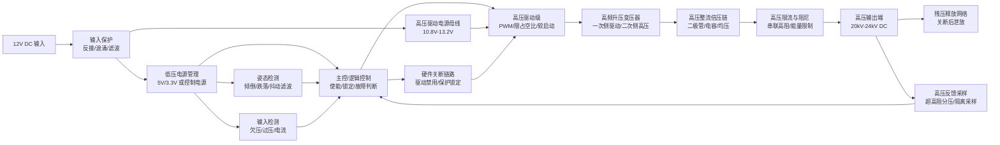
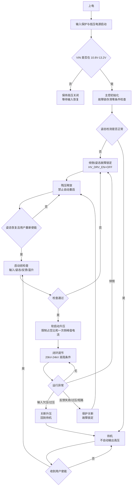
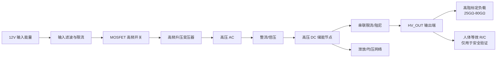
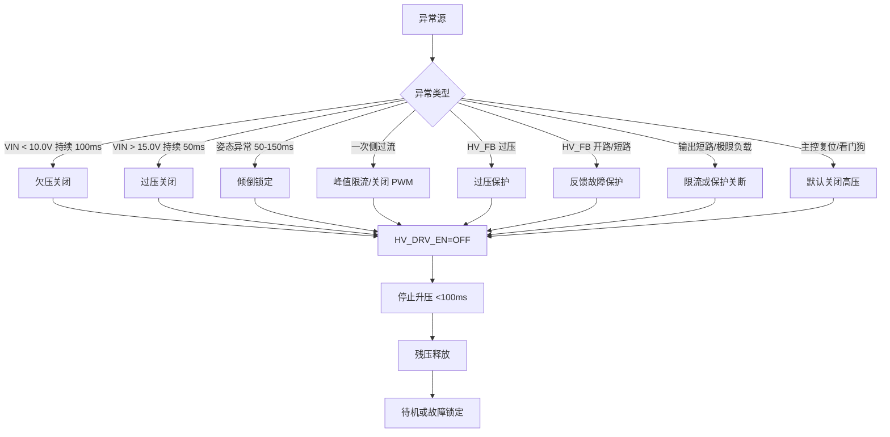

# 24kV 高压美容仪电路结构方案

> 来源：根据《24kV高压美容仪全贴片高压电路板 PRD》整理。
> 本文件用于原理评审、模块划分、PCB 分区和测试方案讨论，不等同于可直接制造的高压原理图。涉及人体附近使用、24kV 高压、灌封绝缘和安规限制，最终元件参数、爬电距离、灌封厚度、输出极性和人体等效限值必须经 EVT/DVT 实测与安规评估冻结。

## 1. 设计目标摘要

| 项目 | 目标 |
|---|---|
| 输入电源 | 12V DC，正常范围 10.8V 至 13.2V |
| 高压输出 | 20kV 至 24kV DC |
| 标定负载电流 | 0.3uA 至 0.8uA，按 25GΩ 至 80GΩ 高阻负载验证 |
| PCB 外形 | 小于 50mm x 30mm |
| 工作模式 | 待机、升压、高压输出、受控空载、保护关断、倾倒锁定 |
| 必备保护 | 反接、欠压、过压、限流、过冲抑制、反馈失效保护、倾倒锁定、残压释放 |
| 可靠性重点 | 长期空载、灌封气泡、爬电、电晕、污染、潮湿、线束端部放电 |

## 2. 推荐电路总架构

整机电路建议按“低压控制区 + 隔离/升压区 + 高压整流倍压区 + 高压输出与泄放区 + 传感保护区”划分。

## 3. 电路模块结构

### 3.1 12V 输入与保护模块

| 子模块 | 结构建议 | 作用 |
|---|---|---|
| 输入接口 | 2Pin 或板端焊盘，正负极防呆标识 | 接入 12V DC |
| 反接保护 | P-MOS 理想二极管结构或串联防反器件 | 满足 12V 反接 60s 不起火、不爆裂 |
| 输入保险/限流 | 可恢复保险丝、熔断电阻或电子限流 | 输入异常时限制热风险 |
| TVS/浪涌吸收 | 输入端 TVS，按目标市场 EMC 冻结 | 抑制浪涌与 ESD 耦合 |
| LC/π 型滤波 | 输入电容、磁珠或电感、旁路电容 | 降低高压驱动回灌纹波和 EMI |
| 输入采样 | 电阻分压进入 ADC 或比较器 | 欠压、过压、掉电状态判断 |

输入保护模块需要在低压区完成，不应让高压回流路径穿越输入端。输入异常时，主控应进入待机或保护状态，不允许自动开启高压。

### 3.2 低压控制与电源管理模块

| 子模块 | 结构建议 | 作用 |
|---|---|---|
| 控制电源 | 12V 转 5V/3.3V LDO 或 DC/DC | 给 MCU、姿态检测、比较器供电 |
| 主控单元 | MCU、低功耗逻辑芯片或专用控制器 | 状态机、软启动、故障锁定 |
| 硬件看门狗 | 独立看门狗或复位监控 | 防止主控卡死后高压失控 |
| 使能输入 | 用户按键/整机控制信号 | 高压启动请求 |
| 故障锁存 | 由 MCU 与硬件保护共同实现 | 倾倒、过压、反馈异常后锁定 |

建议将“高压驱动使能”设计成默认低电平关闭。主控复位、供电异常、姿态检测异常、反馈异常时，驱动级必须保持关闭。

### 3.3 高压驱动与升压模块

| 子模块 | 结构建议 | 作用 |
|---|---|---|
| 振荡/PWM | MCU PWM 或专用振荡控制器 | 控制升压频率、占空比、软启动 |
| 栅极驱动 | MOSFET 驱动器或分立推挽驱动 | 驱动功率开关管 |
| 功率开关 | N-MOSFET，按电流、温升、尖峰裕量选型 | 驱动变压器一次侧 |
| 拓扑选择 | 反激、推挽或谐振升压，EVT 对比 | 在小尺寸内实现二次侧高压 |
| 一次侧采样 | 电流采样电阻或电流检测器件 | 峰值限流、短路保护、过载保护 |
| 吸收钳位 | RCD/TVS/RC Snubber | 抑制一次侧尖峰和 EMI |
| 高压变压器 | 定制高频升压变压器 | 提供隔离和高压交流输出 |

推荐优先评估反激式或推挽式高频升压结构。反激结构控制简单、器件少；推挽结构一次侧利用率更高，但变压器一致性、对称驱动和保护复杂度更高。最终拓扑应由效率、温升、EMI、变压器高度、空载稳定性和供应链共同决定。

### 3.4 高压整流、倍压与限流模块

| 子模块 | 结构建议 | 作用 |
|---|---|---|
| 高压整流链 | 高压二极管串联或倍压整流结构 | 将变压器二次侧转换为 DC 高压 |
| 高压电容链 | 小容量高耐压电容，串并联需均压 | 平滑输出并控制储能 |
| 倍压级数 | 按变压器二次侧电压与尺寸折中确定 | 达到 20kV 至 24kV |
| 均压/泄放 | 电阻均压与关断泄放路径 | 降低单点过压和残压风险 |
| 输出限流 | 高压串联电阻链或等效限流网络 | 限制 0.3uA 至 0.8uA 标定电流和误用电流 |
| 输出阻尼 | RC 阻尼或分布式阻尼结构 | 抑制负载突变过冲和放电振荡 |

高压电容总储能应按 PRD 临时目标小于 0.25mJ 进行约束，并在 DVT 阶段由安规评估冻结。倍压、限流、泄放相关器件是否可贴片，需要由耐压、爬电、温升、灌封可靠性和供应链共同评审。

### 3.5 高压反馈与闭环控制模块

| 子模块 | 结构建议 | 作用 |
|---|---|---|
| 高压采样 | 超高阻分压链或等效隔离采样 | 获得输出电压趋势 |
| 采样保护 | 钳位、滤波、限流、隔离间距 | 防止高压反馈击穿低压控制区 |
| 反馈输入 | ADC 或比较器 | 电压闭环、过压保护、开路控制 |
| 开路识别 | 输出电压高、电流低、反馈稳定性判断 | 长期空载受控运行 |
| 反馈失效检测 | 开路/短路/超范围判定 | 反馈异常时关闭高压 |

反馈回路属于单故障安全关键链路。反馈开路时应关闭高压或进入受限输出；反馈短路时不得导致无限升压。

### 3.6 倾倒与姿态保护模块

| 子模块 | 结构建议 | 作用 |
|---|---|---|
| 姿态传感器 | MEMS 加速度计、滚珠开关、机械倾斜开关或霍尔方案 | 判断正常姿态包络 |
| 抖动滤波 | 软件时间确认 + 硬件 RC/施密特整形 | 避免接点抖动误动作 |
| 触发阈值 | 临时为超出姿态包络连续 100ms | 进入倾倒触发 |
| 恢复条件 | 临时为回到姿态包络连续 300ms | 只允许回到待机，不自动恢复高压 |
| 硬件联锁 | 姿态异常直接拉低驱动使能 | 主控卡死时仍可关闭高压 |

倾倒保护应采用“关闭 + 锁定 + 重新使能”逻辑。设备恢复正常姿态后，高压不得自动恢复。

### 3.7 残压释放与关断模块

| 子模块 | 结构建议 | 作用 |
|---|---|---|
| 被动泄放 | 高压泄放电阻链 | 断电后自然释放残压 |
| 主动泄放 | 受控开关驱动泄放路径，需隔离设计 | 关断或倾倒后加速残压下降 |
| 放电检测 | 残压探头或高阻反馈估算 | 验证残压释放时间 |
| 关断链路 | 关闭 PWM、关闭栅极驱动、硬件禁用 | 100ms 内停止升压 |

残压目标来自 PRD：正常关机和倾倒后 1s 低于 5kV，5s 低于 1kV，30s 低于 60V 或储能小于 0.25mJ。该目标必须通过指定残压测量拓扑实测确认。

## 4. 推荐信号接口

| 信号名 | 方向 | 来源/去向 | 说明 |
|---|---|---|---|
| VIN_12V | 输入 | 整机电源到电路板 | 12V DC 主输入 |
| GND | 输入 | 整机电源到电路板 | 低压参考地 |
| HV_EN_REQ | 输入 | 用户按键或整机主控到本板 | 高压使能请求 |
| HV_DRV_EN | 内部 | 主控/保护链路到驱动级 | 高压驱动许可 |
| PWM_HV | 内部 | 主控到栅极驱动 | 升压控制 PWM |
| VIN_SENSE | 内部 | 输入采样到主控 | 欠压/过压判断 |
| PRI_I_SENSE | 内部 | 一次侧电流采样到主控/比较器 | 峰值限流和短路保护 |
| HV_FB | 内部 | 高压采样到主控/比较器 | 输出电压反馈 |
| TILT_INT | 内部 | 姿态检测到主控/硬件联锁 | 倾倒触发 |
| FAULT_LATCH | 内部 | 保护逻辑 | 故障锁定状态 |
| HV_OUT | 输出 | 高压输出端 | 20kV 至 24kV DC |
| HV_RETURN | 输出 | 高压回路参考端 | 按输出极性和结构定义冻结 |

## 5. 控制流程

## 6. 高压能量链路

## 7. 保护链路

## 8. PCB 与结构分区建议

| 区域 | 内容 | 关键要求 |
|---|---|---|
| 低压输入区 | 12V 接口、反接保护、TVS、滤波 | 靠近输入端，减少浪涌路径面积 |
| 控制区 | MCU、电源管理、姿态检测、采样处理 | 与高压区明确隔离，避免高压耦合 |
| 驱动区 | 栅极驱动、MOSFET、一次侧采样、吸收网络 | 大电流环路短，远离姿态传感器 |
| 变压器区 | 高频升压变压器 | 一次侧/二次侧隔离边界清晰 |
| 高压倍压区 | 高压二极管、高压电容、均压网络 | 作为灌封重点区，避免尖端和窄缝 |
| 高压输出区 | 限流链、输出端子、线束固定 | 端部圆滑、固定、防电晕、防松脱 |
| 泄放反馈区 | 高阻分压、泄放电阻、隔离采样 | 高阻节点防污染、防潮、防漏电 |

布局上应提交《PCB 高低压分区图》《高压风险点标注图》《灌封厚度图》《线束固定和端部处理图》。高压区建议整体灌封，所有尖端、跨层、窄缝、线束出口都应作为风险点标注并验证。

## 9. EVT/DVT 必须冻结项

| 冻结项 | 当前状态 | 冻结依据 |
|---|---|---|
| 输出极性 | PRD 要求立项前确认 | 高阻电压测量拓扑 |
| 升压拓扑 | 待 EVT 评估 | 效率、温升、EMI、空载稳定性 |
| 高压变压器规格 | 待 EVT/DVT 冻结 | 输出电压、绝缘、尺寸、供应链 |
| 倍压级数与器件耐压 | 待 EVT/DVT 冻结 | 20kV 至 24kV 输出及降额 |
| 输出限流网络 | 待安规评估冻结 | 0.3uA 至 0.8uA 标定电流、人体等效风险 |
| 最大储能 | 临时目标小于 0.25mJ | 安规评估、放电测试 |
| 姿态包络 | 待整机结构确认 | 正常握持、贴近皮肤、移动、误放置 |
| 残压释放网络 | 待 DVT 冻结 | 1s/5s/30s 残压实测 |
| 灌封材料与厚度 | 待 DVT 冻结 | 介电强度、气泡、附着力、温循 |
| 测试夹具与测量拓扑 | 待 DVT 冻结 | 1TΩ 开路测量、25GΩ 至 80GΩ 标定负载 |

## 10. 最小原理框图清单

建议原理图至少拆分为以下 Sheet：

1. `PWR_INPUT_PROTECTION`：12V 输入、反接、TVS、滤波、输入采样。
2. `LV_CONTROL`：控制电源、MCU/逻辑、看门狗、使能输入、故障锁存。
3. `TILT_PROTECTION`：姿态传感器、抖动滤波、硬件联锁。
4. `HV_DRIVER_PRIMARY`：PWM/振荡、栅极驱动、MOSFET、一次侧限流、吸收钳位。
5. `HV_TRANSFORMER_SECONDARY`：升压变压器、二次侧隔离边界。
6. `HV_RECTIFIER_MULTIPLIER`：高压整流、倍压、均压、储能限制。
7. `HV_OUTPUT_LIMIT_BLEED`：输出限流、阻尼、泄放、输出端子。
8. `HV_FEEDBACK_MEASURE`：超高阻反馈、隔离采样、过压/反馈失效保护。
9. `TEST_POINTS_EOL`：低压测试点、降额输出检测点、姿态夹具接口、残压测试接口。

## 11. 结论

本 PRD 对输出规格和安全边界定义较完整，但未指定可直接制造的高压原理图。推荐电路结构为：

`12V 输入保护 -> 低压控制与姿态锁定 -> 高频高压驱动 -> 升压变压器 -> 高压整流/倍压 -> 限流/阻尼 -> 高压输出 -> 反馈闭环与残压释放`

该结构能覆盖 PRD 中的 20kV 至 24kV DC、0.3uA 至 0.8uA、高阻标定负载、长期空载、倾倒保护、单故障和量产测试要求。下一步应进入 EVT 原理验证，重点验证升压拓扑、变压器、倍压链、限流网络、反馈失效保护、灌封绝缘和残压释放。
